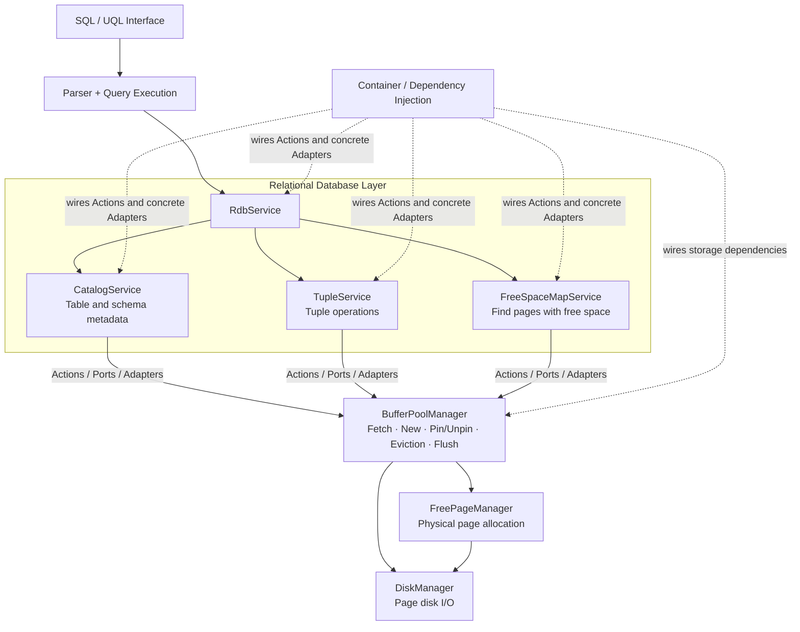

# UniDB V1 Architecture

```mermaid
flowchart TD
    SQL["SQL / UQL Interface"]
    Query["Parser + Query Execution"]

    subgraph RDB_LAYER["Relational Database Layer"]
        RDB["RdbService"]
        Catalog["CatalogService<br/>Table and schema metadata"]
        Tuple["TupleService<br/>Tuple operations"]
        FSM["FreeSpaceMapService<br/>Find pages with free space"]
        RDB --> Catalog
        RDB --> Tuple
        RDB --> FSM
    end

    BPM["BufferPoolManager<br/>Fetch · New · Pin/Unpin · Eviction · Flush"]
    FPM["FreePageManager<br/>Physical page allocation"]
    Disk["DiskManager<br/>Page disk I/O"]
    Container["Container / Dependency Injection"]

    SQL --> Query
    Query --> RDB

    Catalog -->|"Actions / Ports / Adapters"| BPM
    Tuple -->|"Actions / Ports / Adapters"| BPM
    FSM -->|"Actions / Ports / Adapters"| BPM

    BPM --> FPM
    BPM --> Disk
    FPM --> Disk

    Container -. "wires Actions and concrete Adapters" .-> RDB
    Container -. "wires Actions and concrete Adapters" .-> Catalog
    Container -. "wires Actions and concrete Adapters" .-> Tuple
    Container -. "wires Actions and concrete Adapters" .-> FSM
    Container -. "wires storage dependencies" .-> BPM
```
